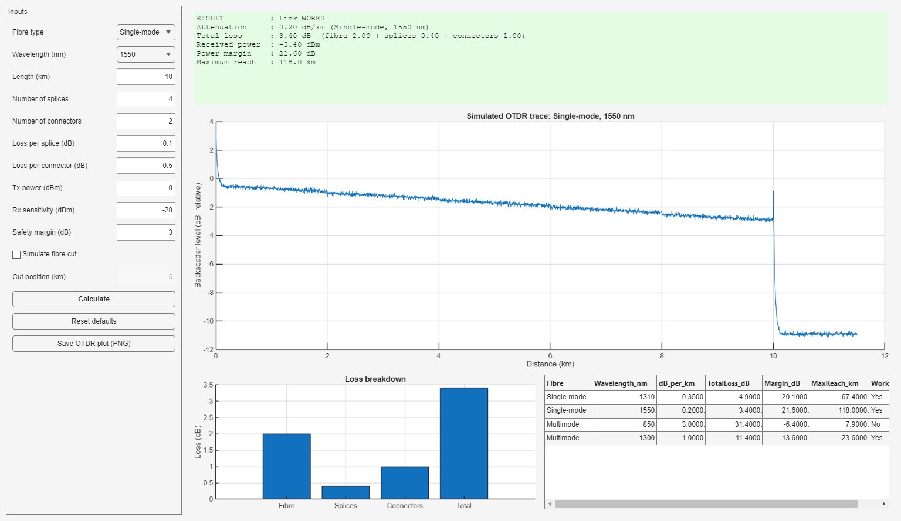
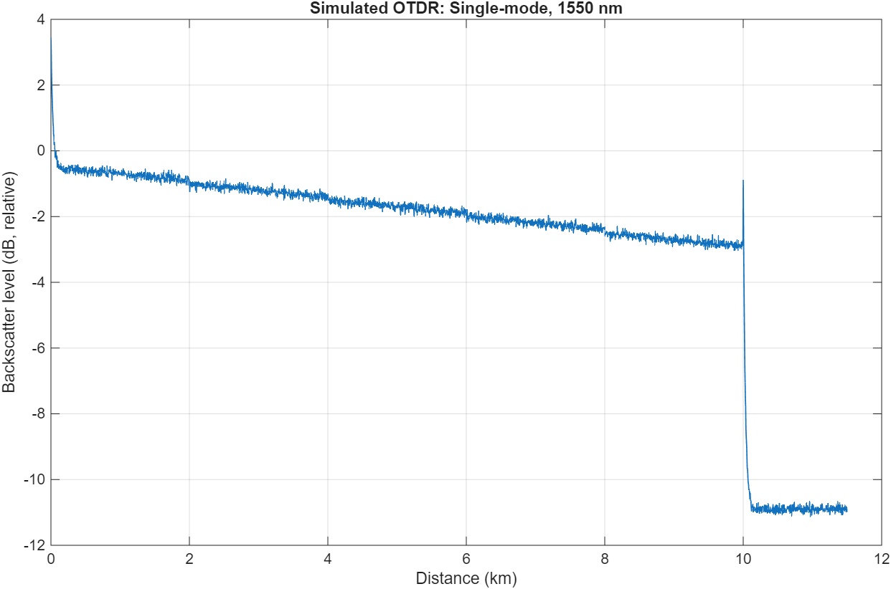
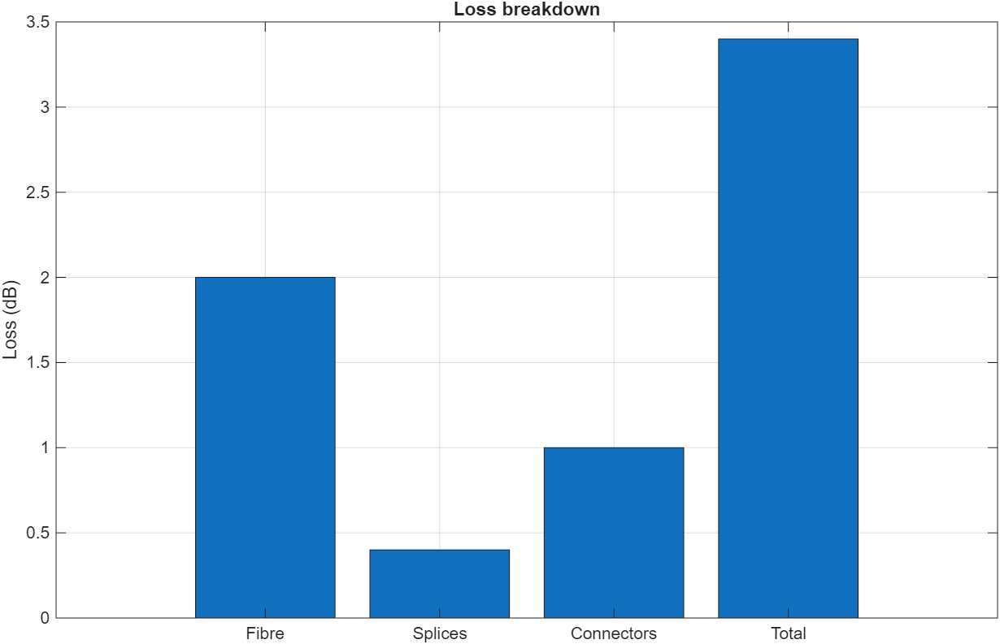
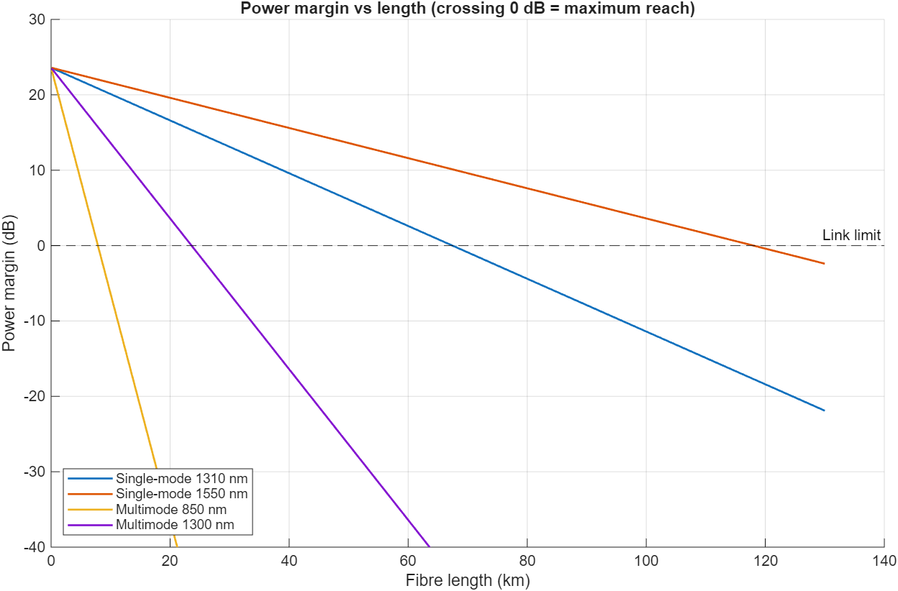

# Fibre Optic Link Budget & OTDR Simulator (MATLAB)

A MATLAB tool that calculates link loss, power margin and maximum reach for
single-mode and multimode fibre, and simulates an OTDR trace showing splices,
connectors and fibre-cut faults. Built after my industrial training at
BSNL, O/o SDO (T) Dalhousie (fibre optic communication, NGN exchange).

**Author:** Nandinee Tandon, ECE, NIT Hamirpur

## Features

- Link budget at 1310/1550 nm (single-mode) and 850/1300 nm (multimode)
- Total loss, received power, power margin, maximum reach, working/failing verdict
- Simulated OTDR trace: attenuation slope, splice steps, connector spikes, fibre cut
- Single-mode vs multimode comparison table
- Interactive GUI (`fibreApp`) with dropdowns, live plots and comparison table
- Margin-vs-length sweep showing the maximum reach of each fibre
- Test script that checks results against hand calculations

## Requirements

- MATLAB R2020a or later (the GUI and figure export need it; `main.m` alone runs on R2016b+)
- No extra toolboxes

## Project structure

```
main.m                    script version: inputs, results, plots
fibreApp.m                GUI version (type fibreApp in MATLAB)
src/
    getAttenuation.m      dB/km lookup
    calcLinkBudget.m      link budget formulas
    buildOTDRTrace.m      OTDR trace simulation
    compareFibres.m       single-mode vs multimode table
    plotResults.m         OTDR trace and loss breakdown figures
    plotMarginSweep.m     margin vs length for all fibres
tests/
    runTests.m            checks against hand calculations
docs/
    theory.md             formulas and background
screenshots/              output images
```

## How to run

1. Clone or download this repository.
2. In MATLAB, set the **Current Folder** to the project root.

**GUI (recommended):** type `fibreApp` in the Command Window.

**Script version:**

1. Open `main.m`.
2. Edit the INPUTS section (length, splices, connectors, power, cut position).
3. Press **Run**.

**Tests:** open `tests/runTests.m` and press **Run**. All 12 checks should print PASS.

## Formulas

```
Total loss = alpha*L + Ns*Ls + Nc*Lc
Prx        = Ptx - Total loss
Margin     = Prx - Sensitivity - Safety margin    (>= 0 : link works)
```

## Example (10 km, 1550 nm, 4 splices, 2 connectors)

Total loss 3.40 dB, received power -3.40 dBm, margin 21.60 dB, max reach 118 km.

## Screenshots









(Set `saveFigures = true` in `main.m` to generate the plot images.)

## Limitations

Attenuation and event losses are typical textbook values, and the OTDR trace
is a simplified simulation, not real instrument data. The model covers loss
only (no dispersion, nonlinear effects or amplifiers).

## Future work

- Automatic event detection on the trace
- Comparison with real OTDR data
- Dispersion / bandwidth limits for multimode fibre

## License

MIT